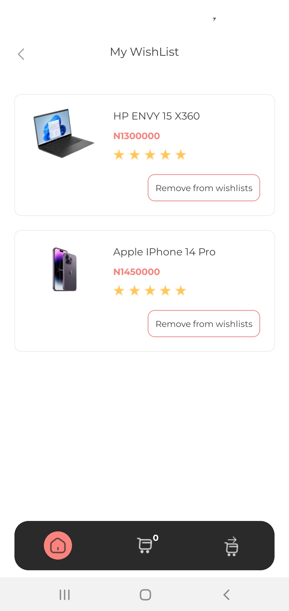

# Malltiverse Super Shop
This is multi product vendor mobile app that implements the api functionalities of an edge-cutting B2B and B2C web application called Timbu, Timbu allows users to upload, share and market their digital products

The Store sells products in the category of men's fashion, women's fashion and tech gadgets.


# Running the App Locally

1. Install dependencies

   ```bash
   npm install
   ```

2. Start the app

   ```bash
    npx expo start
   ```

In the output, you'll find options to open the app in a

- [development build](https://docs.expo.dev/develop/development-builds/introduction/)
- [Android emulator](https://docs.expo.dev/workflow/android-studio-emulator/)
- [iOS simulator](https://docs.expo.dev/workflow/ios-simulator/)
- [Expo Go](https://expo.dev/go), a limited sandbox for trying out app development with Expo


## Learn more about timbu


- [Timbu Website](https://timbu.cloud/) visit https://timbu.cloud/
- [Timbu Docs](https://timbu.cloud/): visit https://timbu.cloud/

## APP SCREENSHOTS

### Payment Success
 

### Enter Card Details Screen


### Card Details

 
 
 
 ### Checkout

  
  
  ### Cart Page
  
   
   
   ### Product Listing Page
   


### Order History

   

### Wishlist page



# Download and demo the app

## Appetize Demo Link
https://appetize.io/app/b_efusqpb6hmkmku5pderane6un4

## APK Download Link

https://expo.dev/artifacts/eas/jeKZUcbBJGUXz1yNHGzKnF.apk